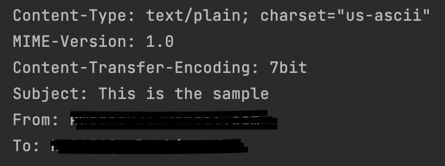
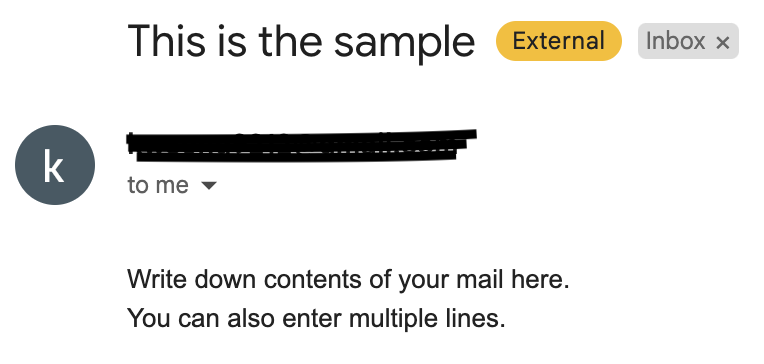

This project aims to collaborate on several files to achieve the final goal of 
"finding specific emails through keywords and notifying them through messengers such as Slack." 

I have included comments mainly about the functions in each project file (.py). 
In this file, I will document the plan, bugs, and problems that occurred during the testing process.

{: width="100" height="100"}
{: width="100" height="100"}

After several tests, the program was successful in sending an email to the target email address using Python code, with a Gmail address as the sender. Next, we will work on implementing the ability to send emails with attached files.
